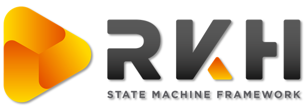
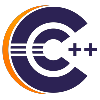
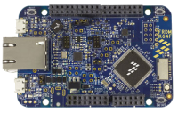
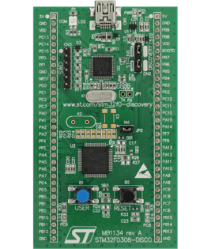

    

# Examples  
Collection of open source examples based on RKH framwework for embedded systems development on Linux, Windows, and other embedded platforms.

Platform | Toolchain | Example | Description
-- | -- | -- | --
 |  | [blinky.cmake.package](blinky.cmake.package) | It shows how to build a simple Blinky state machine using the RKH CMake package.
 |  | [blinky.cmake.cpp](blinky.cmake.cpp) | It shows how to build a simple Blinky state machine written in C++ using CMake. Despite RKH framework is written in C language, it could be used in a C++ application without much effort as shown in this example. In this case, it uses RKH framework as a static library.
 |  | [blinky.cmake](blinky.cmake) | It shows how to build a simple Blinky state machine using CMake. This example uses RKH framework as a static library.
 |  | [parameterized-sm.eclipse-cdt](parameterized-sm.eclipse-cdt) | It shows how to handle a parameterized state machine (i.e. array of state machines) from an active object by using the RKH framework.
 |  | [timeEvent.Yakindu.linux](timeEvt.yakindu.linux) | It shows how to use the RKH framework together with Yakindu Statechart Tool for using Time Event's in statecharts models.
 |  | [timeEvent.Yakindu.FRDM-K64F](timeEvt.yakindu.frdm-k64f) | *It shows how to use the RKH framework together with Yakindu Statechart Tool for using Time Event's in statecharts models. Coming soon*
 |  | [timeEvent.Yakindu.STM32-disc1](timeEvt.yakindu.stm32-disc1) | *It shows how to use the RKH framework together with Yakindu Statechart Tool for using Time Event's in statecharts models. Coming soon*
