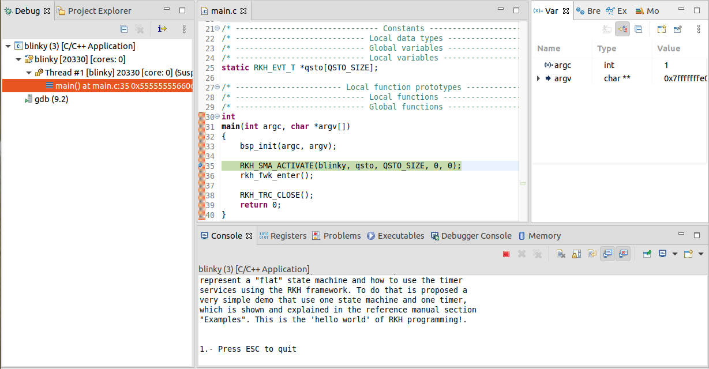

# Blinky application with RKH framework built by CMake and written in C++
## Content:
- [Overview](#overview)
- [What RKH is?](#what-rkh-is)
- [Toolchain installation](#toolchain-installation)
- [CMake project](#cmake-project)
  - [Build](#build)
  - [Run](#run)
  - [Working with CMake and Eclipse CDT](#working-with-cmake-and-eclipse-cdt)

## Overview
Blinky application is a simple but self-explanatory example 
to understand how to represent a state machine, how to use time events, 
and how to analyze a state machine behaviour by means of the RKH framework. 
Moreover, since this example is built by CMake, it could be used as a starting 
point for building applications based on RKH framework using CMake.
The Blinky application could be thought as the _hello world_ program of 
a traditional programming language.

Despite RKH framework is written in C language, it could be used in a C++ 
application without much effort. This is mainly due to RKH framework was 
developed from ground up using OOP concepts. However, you have to keep in 
mind the following things if you want to use it in your C++ application:

- An active class must be derived from the class ```RKH_SMA_T``` of RKH.
- Every state machine's action must be implemented as a C callback function, 
  whose signature must comply with RKH requirements, but the body of these 
  callbacks is written in C++ language.

The behavior of Blinky is defined by the following state diagram.


## What RKH is?
RKH is a flexible, efficient, highly portable, and freely available 
open-source state machine framework providing the infrastructure for quickly 
and safely developing reactive applications for real-time embedded systems.


RKH provides not only an unusual, efficient and straightforward method for implementing and executing state machines, but also the needed infrastructure to build reactive applications in embedded systems. It is composed of modules, procedures, and supporting tools; such as a method for implementing and executing flat state machines and statecharts, asynchronous messaging, cross-platform abstraction, run time tracing, time management, dynamic memory mechanism to deal with fragmentation, unit-test harness, plus others.

RKH allows developers to verify and validate a reactive application’s behaviour at runtime by means of the framework’s built-in tracer. It can utilize any traditional OS/RTOS or work without one. It also encourages the embedded software community to apply best principles and practices of software engineering for building flexible, maintainable and reusable software.

RKH is open source and licensed under the GNU v3.0\. You can find the [source code on GitHub](https://github.com/vortexmakes/RKH).

If you want to learn more about the benefits of this flexible, efficient and highly portable state machine framework read on [here](https://blogs.itemis.com/en/rkh-state-machine-framework-for-reactive-and-real-time-embedded-systems).

## Toolchain installation
### CMake
[CMake](https://cmake.org/) is an open-source, cross-platform family of tools designed to build, test and package software.
There are several ways to install CMake, depending on your platform. Follow [these](https://cliutils.gitlab.io/modern-cmake/chapters/intro/installing.html) instructions to do that.

### Trazer tool
RKH allows developers to verify and validate a reactive application's behaviour at runtime by means of its built-in tracer. In addition, RKH provides a very simple but powerful console application, called Trazer, to visualize the trace events' output in a legible manner. It can be downloaded and installed as follows.

1. Download Trazer for Linux 64-bits from its [official repository](https://github.com/vortexmakes/Trazer/releases/download/3.2/RC_trazer_3_2_lnx64b.tar.gz)
2. Copy downloaded file to a folder and extract it
3. Change the directory to previous folder
4. Check it is alright by executing `./trazer`

## CMake project
### Project structure
#### _model_
It contains Blinky state machine model

#### _src_
It includes the application code written in C++ language. The most important files and directories are listed below:
- _signal.h_: defines signals as enumerated constants, which are used as state machine triggers.
- _event.h_: defines events types, which are derived from RKH framework types.
- _priority.h_: defines active object priorities as enumerated constants.
- _blinky.h/.cpp_: specifies and implements respectively the Blinky active object. Please correlate this implementation with the state diagram shown above.
- _main.cpp_: contains the `main()` function, which initializes both BSP and Blinky active object, then executes the RKH framework in order to orchestrates this reactive application.
- _rkhcfg.h_: adapts and configures RKH in compile-time.
- _CMakeLists.txt_: to make the executable
- _bsp.h_: defines the BSP abstraction layer
- *rkhfwk_adapter.h*: defines utilities for using RKH framework in a C++ application. This file is going to be part of RKH framework in future releases.
- *bsp_blinky.cpp*: implements a BSP specific part according to this example.

##### Other alternatives
Knowing that C++ is a powerful and versatile language, this project proposes several alternatives, listed below, to use RKH framework in a C++ application. 
1. **Public version** (*blinky.public.h*/*blinky.public.cpp*/*bsp_blinky.non-singleton.cpp*/*main.non-singleton.cpp*):
    - Every C callback just calls a specific C++ method of the active class.
    - It means that every C callback has its own C++ method, whose implementation 
      represents the action's behavior of a state machine.
    - C callbacks are private, static and non-member functions of the active 
    class.
    - Before accessing to active class members callbacks must perform a 
    downcast to the active class.
    - Using inheritance the behavior of state machine's actions could 
    be dynamically changed.
    - In order to test this alternative you have to rename files 
    *blinky.public.h*/*blinky.public.cpp*/*bsp_blinky.non-singleton.cpp*/*main.non-singleton.cpp* 
    to blinky.h/blanky.cpp/bsp_blinky.cpp/main.cpp respectively.
2. **Private version** (*blinky.private.h*/*blinky.private.cpp*/*bsp_blinky.non-singleton.cpp*/*main.non-singleton.cpp*):
    - C callbacks implement the action's behavior using C++ as usual.
    - These callbacks are non-member functions, so they are declared as friends 
    of the active class to access to its members.
    - Before accessing to active class members callbacks must perform a 
    downcast to the active class.
    - In order to test this alternative you have to rename files 
    _blinky.public.h_/_blinky.public.cpp_/*bsp_blinky.non-singleton.cpp*/*main.non-singleton.cpp* 
    to blinky.h/blanky.cpp/bsp_blinky.cpp/main.cpp respectively.
3. **Protected version** (*blinky.protected.h*/*blinky.protected.cpp*/*bsp_blinky.non-singleton.cpp*/*main.non-singleton.cpp*):
    - Every C callback just calls a specific C++ method of the active class.
    - It means that every C callback has its own C++ method, which implements
      the dynamic action's behavior.
    - C callbacks are private and non-member functions of the active class.
    - Having defined C++ methods as protected, C callbacks were declared as
      friends of the active class.
    - Before accessing active class members callbacks must perform a
      downcast to the active class.
    - Using inheritance the behavior of state machine's actions could
      be dynamically changed.
    - In order to test this alternative you have to rename files 
    _blinky.pprotected.h_/_blinky.protected.cpp_/*bsp_blinky.non-singleton.cpp*/*main.non-singleton.cpp* 
    to blinky.h/blanky.cpp/bsp_blinky.cpp/main.cpp respectively.
4. **Lazy singleton version** (*blinky.lazy-singleton.h*/*blinky.lazy-singleton.cpp*/*bsp_blinky.lazy-singleton.cpp_/*main.lazy-singleton.cpp*):
    - This alternative is very similar to previous ones. The main 
    difference is that the active class can only be instantiated once but 
    providing a way for clients to access that class in such a way that the 
    same single object is returned each time. This is commonly referred to as 
    a singleton pattern, or a singleton class.
    - In order to test this alternative you have to rename files 
    *blinky.lazy-singleton.h*/*blinky.lazy-singleton.cpp*/
    *bsp_blinky.lazy-singleton.cpp*/*main.lazy-singleton.cpp* to 
    blinky.h/blinky.cpp/bsp_blinky.cpp/main.cpp respectively.
5. **Hidden Singleton version** (*blinky.closed-singleton.h*/*blinky.closed-singleton.cpp*/*bsp_blinky.closed-singleton.cpp*/*main.closed-singleton.cpp*):
    - This alternative is a kind of singleton class in which its specification 
    is entirely hidden. It provides a constant, opaque and global pointer to 
    access the only class instance.
    - In order to test this alternative you have to rename files 
    _blinky.closed-singleton.h_/_blinky.closed-singleton.cpp_/
    _bsp_blinky.closed-singleton.cpp_/main.closed-singleton.cpp_ to 
    blinky.h/blinky.cpp/bsp_blinky.cpp/main.cpp respectively.

#### _third-party_
It contains Git submodules almost exclusively.
- _RKH_: here is located the RKH framework's source code as a Git submodule.
- _CMakeLists.txt_: to make a static library from RKH's source code

#### _CMakeLists.txt_
Top level CMakeLists.txt. CMake is controlled by input files that by 
convention are called CMakeLists.txt, which lists both configuration commands
as well as dependencies between source files and targets. A CMake-based build 
system is organized as a set of high-level logical targets. Each target 
corresponds to an executable or library, or is a custom target containing 
custom commands. 
In this case, this file calls the CMakeLists.txt in the sub-directories 
_src_ and _third-party_ to create the following:
- _blinky_: an executable from source code in _src_ directory
- _rkh_: a static library from RKH framework in _third-party/RKH_ directory

#### _build_
All temporary build and object files are located in this directory keeping the source tree clean.

### Build
Set the RKH environment defining an environment variable called `RKH_BASE` that
sets the path to the RKH base directory. It will be used by the build system.
`RKH_BASE` can explicitly be set by typing:
``` bash
export RKH_BASE="path/to/rkh-examples/blinky.cmake.cpp/third-party/RKH"
```

These instructions are part of the classic CMake build procedure:
1. `cd path/to/rkh-examples/blinky.cmake.cpp/build`
2. `cmake .. -DRKH_DEV_BUILD=ON -DRKH_PLATFORM="__LNXGNU__" -DGIT_SUBMODULE=ON`
3. `make`

Alternatively, if you are using a modern CMake, you can instead do this:
1. `cd path/to/rkh-examples/blinky.cmake.cpp`
2. `cmake -S . -DRKH_DEV_BUILD=ON -B build -DRKH_PLATFORM="__LNXGNU__" -DGIT_SUBMODULE=ON`
3. `cmake --build build`

### Run
- Open a console, change the directory where you previously downloaded Trazer, and run it by executing the following command line: `./trazer -t 6602`
- Open another console, and run the blinky application following these instructions:
  - `cd path/to/rkh-examples/blinky.cmake.cpp/build`
  - `./src/blinky`

### Working with CMake and Eclipse CDT
The RKH environment is defined through the environment variable `RKH_BASE` that
sets the path to the RKH base directory. It will be used by the build system.
`RKH_BASE` can explicitly be set by typing:
``` bash
export RKH_BASE="path/to/rkh-examples/blinky.cmake.cpp/third-party/RKH"
```

#### Generate an Eclipse CDT project from CMake
First of all, run CMake using the Eclipse generator __"Eclipse CDT4 - Unix Makefiles"__.
1. `cd path/to/rkh-examples/`
2. `mkdir build`
3. `cd build`
4. `cmake ../blinky.cmake.cpp -DRKH_DEV_BUILD=ON -DRKH_PLATFORM="__LNXGNU__" -DGIT_SUBMODULE=ON -G"Eclipse CDT4 - Unix Makefiles" -DCMAKE_BUILD_TYPE=Debug`

#### Import the generated Eclipse CDT project
Then, import the previously generated project in Eclipse:
1. Select __File__ > __Import...__ to bring up the __Import__ wizard. 
2. Choose __Existing Project into Workspace__ and click the __Next__ button.
3. Select the `path/to/rkh-examples/build` project directory.
4. Click the __Finish__ button to import the selected project into the workspace. 

#### Build
1. Right-click on project __blinky-Debug@build__ in the __Project Explorer__
2. Choose __Build Project__

#### Run
- Open a console, change the directory where you previously downloaded Trazer, and run it by executing the following command line: `./trazer -t 6602`
- [Import CMake project in Eclipse CDT](#importing-cmake-project-in-eclipse-cdt)
- Right-click on project __blinky-Debug@build__ in the Eclipse __Project Explorer__
- Choose __Run As__ > __Local C/C++ Application__ > blinky (with green bug label, located in _src/blinky_). The embedded Eclipse console shows up and the application starts


#### Debug
- Open a console, change the directory where you previously downloaded Trazer, and run it by executing the following command line: `./trazer -t 6602`
- [Import CMake project in Eclipse CDT](#importing-cmake-project-in-eclipse-cdt)
- Right-click on project __blinky-Debug@build__ in the Eclipse __Project Explorer__
- Choose __Debug As__ > __Local C/C++ Application__ > blinky (with green bug label, located in _src/blinky_). You will now see the debug perspective with the Blinky application window open. The C/C++ editor repositions in 
the perspective.



### Verify and validate
While the application is running, you can validate and verify its behaviour through the trace events showed on the Trazer output.
Each trace event includes a time stamp and additional information associated with it. A capture of Trazer output is shown below. 


It shows the trace records when the state machine processes a `after 2s`
trigger. Since RKH can generate more than 100 different trace events 
during its execution, its trace module allow you to filter one or more 
of them in runtime, so you can choose the traces that you need.
