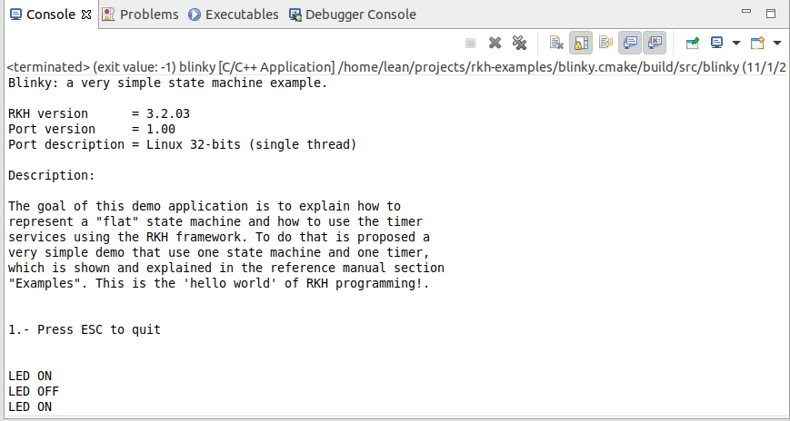
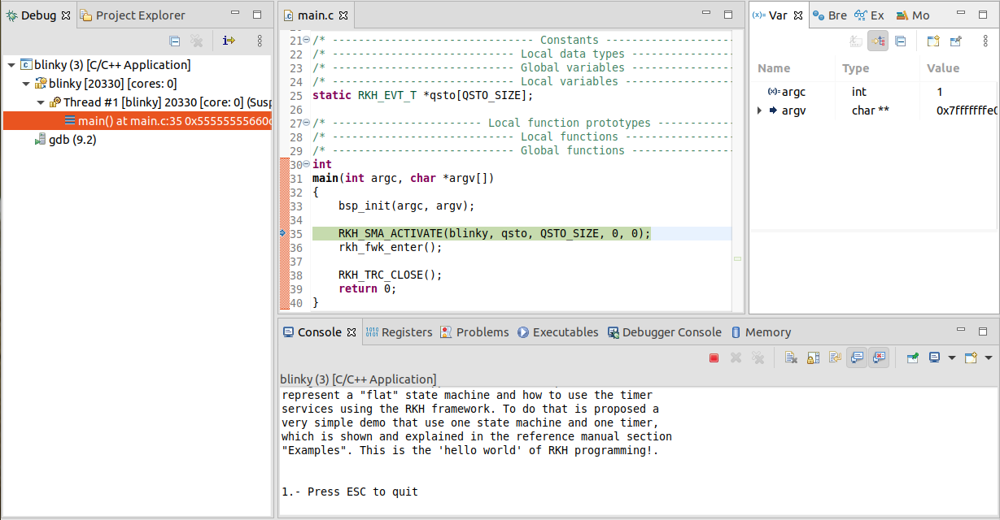

# Blinky application with RKH framework built by CMake
## Content:
- [Overview](#overview)
- [What RKH is?](#what-rkh-is)
- [Toolchain installation](#toolchain-installation)
- [CMake project](#cmake-project)
  - [Build](#build)
  - [Run](#run)
  - [Working with CMake and Eclipse CDT](#working-with-cmake-and-eclipse-cdt)

## Overview
Blinky application is a simple but self-explanatory example 
to understand how to represent a "flat" state machine, how to use time events, 
and how to analyze a state machine behaviour by means of the RKH framework. 
Moreover, since this example is built by CMake, it could be used as a starting 
point for building applications based on RKH framework using CMake.
The Blinky application could be thought as the _hello world_ program of 
a traditional programming language.

The behavior of Blinky is defined by the following state diagram.


## What RKH is?
RKH is a flexible, efficient, highly portable, and freely available 
open-source state machine framework providing the infrastructure for quickly 
and safely developing reactive applications for real-time embedded systems.


RKH provides not only an unusual, efficient and straightforward method for implementing and executing state machines, but also the needed infrastructure to build reactive applications in embedded systems. It is composed of modules, procedures, and supporting tools; such as a method for implementing and executing flat state machines and statecharts, asynchronous messaging, cross-platform abstraction, run time tracing, time management, dynamic memory mechanism to deal with fragmentation, unit-test harness, plus others.

RKH allows developers to verify and validate a reactive application’s behaviour at runtime by means of the framework’s built-in tracer. It can utilize any traditional OS/RTOS or work without one. It also encourages the embedded software community to apply best principles and practices of software engineering for building flexible, maintainable and reusable software.

RKH is open source and licensed under the GNU v3.0\. You can find the [source code on GitHub](https://github.com/vortexmakes/RKH).

If you want to learn more about the benefits of this flexible, efficient and highly portable state machine framework read on [here](https://blogs.itemis.com/en/rkh-state-machine-framework-for-reactive-and-real-time-embedded-systems).

## Toolchain installation
### CMake
[CMake](https://cmake.org/) is an open-source, cross-platform family of tools designed to build, test and package software.
There are several ways to install CMake, depending on your platform. Follow [these](https://cliutils.gitlab.io/modern-cmake/chapters/intro/installing.html) instructions to do that.

### Trazer tool
RKH allows developers to verify and validate a reactive application's behaviour at runtime by means of its built-in tracer. In addition, RKH provides a very simple but powerful console application, called Trazer, to visualize the trace events' output in a legible manner. It can be downloaded and installed as follows.

1. Download Trazer for Linux 64-bits from its [official repository](https://github.com/vortexmakes/Trazer/releases/download/3.2/RC_trazer_3_2_lnx64b.tar.gz)
2. Copy downloaded file to a folder and extract it
3. Change the directory to previous folder
4. Check it is alright by executing `./trazer`

## CMake project
### Project structure
#### _model_
It contains Blinky state machine model

#### _src_
It includes the application code. The most important files and directories are listed below:
- _signal.h_: defines signals as enumerated constants, which are used as state machine triggers.
- _event.h_: defines events types, which are derived from RKH framework types.
- _priority.h_: defines active object priorities as enumerated constants.
- _blinky.h/.c_: specifies and implements the Blinky active object. Please correlate this implementation with the state diagram shown above.
- _main.c_: contains the `main()` function, which initializes both BSP and Blinky active object, then executes the RKH framework in order to orchestrates this reactive application.
- _rkhcfg.h_: adapts and configures RKH in compile-time.
- _CMakeLists.txt_: to make the executable
- _bsp.h_: defines the BSP abstraction layer

#### _CMakeLists.txt_
CMake is controlled by input files that by 
convention are called `CMakeLists.txt`, which lists both configuration commands
as well as dependencies between source files and targets. A CMake-based build 
system is organized as a set of high-level logical targets. Each target 
corresponds to an executable or library, or is a custom target containing 
custom commands. 
In this case, this file includes the RKH CMake package version 3.3.00 by 
using the `find_package()` command.

#### _build_
All temporary build and object files are located in this directory keeping the source tree clean.

### Build
The RKH CMake package is another way to use RKH from an application. It ensures 
that CMake can automatically select RKH to build the application. By using this 
approach, a developer just needs to write `find_package(rkh)` at the beginning 
of the application `CMakeLists.txt` file.

Since RKH is a cross-platform framework and it is configured at compile-time, 
distributing it as a library binary is not a suitable and flexible option. In 
contrast, it is more suitable to provide the RKH source code and the proper 
rules to build it, and then generate your own RKH library binary according 
to your requirements.

#### Get RKH framework
In order to build this example you have to download the RKH framework, then 
build and install it. RKH can be obtained from its official repository by 
using the following commands:

``` bash
cd path/to/<projects>
git clone https://github.com/vortexmakes/RKH.git
```

#### Build and install RKH framework
##### Builing RKH
``` bash
cd path/to/<projects>
mkdir <install>
cd RKH
cmake -S . -B build -DRKH_DEV_BUILD=ON -DRKH_PLATFORM="__LNXGNU__" \
                    -DCMAKE_INSTALL_PREFIX="path/to/<projects>/<install>" \
                    -DRKH_CONF_FILE="path/to/<projects>/rkh-examples/blinky.cmake.package/src/rkhcfg.h"
cmake --build build
```

RKH is configured at compile-time through a header file named `rkhcfg.h`. In 
the previous example, the RKH configuration file was taken from the path 
`path/to/<projects>/rkh-examples/blinky.cmake.package/src/rkhcfg.h`. If an 
RKH package was reused by multiple applications within the same workspace, 
the RKH configuration file should be located in a more suitable place, 
for example, within a common directory.

The value of `CMAKE_INSTALL_PREFIX` used in the previous commands indicates 
the installation prefix to be searched by the `find_package()` command.

##### Installing RKH
After building RKH, you have to install the generated files typing the 
following command:
``` bash
cmake --build build --target install
```

Having used this command, the generated files are copied to a directory named 
`rkh-<version>` located in the path specified by `CMAKE_INSTALL_PREFIX`. The 
suffix `<version>` indicates the installed RKH version. 

##### Exporting RKH CMake package
Before using the RKH CMake package, it must be exported to the 
[CMake user package registry](https://cmake.org/cmake/help/latest/manual/cmake-packages.7.html#user-package-registry). 
It means creating a reference to the current RKH installation inside the CMake 
user package registry. In Linux/macOS it should be found in `~/.cmake/package`.

RKH CMake package is exported to the CMake user package registry using the 
following command:
``` bash
cd path/to/<projects>/<install>/rkh-<version>/lib/cmake/rkh/
cmake -P rkh_export.cmake
``` 

Having installed RKH on your workspace, build and run your application as 
described in the following sections.

#### Building the application
These instructions are part of the classic CMake build procedure:
``` bash
cd path/to/<projects>/rkh-examples/blinky.cmake.package/build
cmake ..
make
```

Alternatively, if you are using a modern CMake, you can instead do this:
``` bash
cd path/to/<projects>/rkh-examples/blinky.cmake.package
cmake -S . -B build
cmake --build build
```

### Run
- Open a console, change the directory where you previously downloaded 
Trazer, and run it by executing the following command line: 
``` bash
./trazer -t 6602
```
- Open another console, and run the blinky application following these 
instructions:
``` bash
cd path/to/<projects>/rkh-examples/blinky.cmake.package/build
./Blinky
```

### Working with CMake and Eclipse CDT
#### Generate an Eclipse CDT project from CMake
First of all, run CMake using the Eclipse generator __"Eclipse CDT4 - Unix Makefiles"__.
``` bash
cd path/to/<projects>/rkh-examples/
cmake -S . -B build  -G"Eclipse CDT4 - Unix Makefiles" -DCMAKE_BUILD_TYPE=Debug
```

#### Import the generated Eclipse CDT project
Then, import the previously generated project in Eclipse:
1. Select __File__ > __Import...__ to bring up the __Import__ wizard. 
2. Choose __Existing Project into Workspace__ and click the __Next__ button.
3. Select the `path/to/<projects>/rkh-examples/build` project directory.
4. Click the __Finish__ button to import the selected project into the workspace. 

#### Build
1. Right-click on project __blinky-Debug@build__ in the __Project Explorer__
2. Choose __Build Project__

#### Run
- Open a console, change the directory where you previously downloaded Trazer, and run it by executing the following command line: `./trazer -t 6602`
- [Import CMake project in Eclipse CDT](#importing-cmake-project-in-eclipse-cdt)
- Right-click on project __blinky-Debug@build__ in the Eclipse __Project Explorer__
- Choose __Run As__ > __Local C/C++ Application__ > blinky (with green bug label, located in _src/blinky_). The embedded Eclipse console shows up and the application starts



#### Debug
- Open a console, change the directory where you previously downloaded Trazer, and run it by executing the following command line: `./trazer -t 6602`
- [Import CMake project in Eclipse CDT](#importing-cmake-project-in-eclipse-cdt)
- Right-click on project __blinky-Debug@build__ in the Eclipse __Project Explorer__
- Choose __Debug As__ > __Local C/C++ Application__ > blinky (with green bug label, located in _src/blinky_). You will now see the debug perspective with the Blinky application window open. The C/C++ editor repositions in 
the perspective.



### Verify and validate
While the application is running, you can validate and verify its behaviour through the trace events showed on the Trazer output.
Each trace event includes a time stamp and additional information associated with it. A capture of Trazer output is shown below. 


It shows the trace records when the state machine processes a `after 2s`
trigger. Since RKH can generate more than 100 different trace events 
during its execution, its trace module allow you to filter one or more 
of them in runtime, so you can choose the traces that you need.
