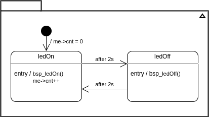

# Blinky application with RKH framework built by CMake

## Overview
The __Blinky__ application is a very simple but self-explanatory example 
to explain how to represent a "flat" state machine, how to use time events, 
and how to analyze a state machine behaviour by means of the RKH's trace 
facility. This application could be thought as the _hello world_ program of 
a traditional programming language.

The behavior of __Blinky__ is defined by the following state diagram.

## This tutorial contains:
[1\. Description](#1-description)

[2\. What RKH is?](#2-what-rkh-is)

[3\. Toolchain installation](#3-toolchain-installation)

[4\. Eclipse CDT project](#4-eclipse-cdt-project)

## 1\. Description
...

## 2\. What RKH is?
RKH is a flexible, efficient, highly portable, and freely available 
open-source state machine framework providing the infrastructure for quickly 
and safely developing reactive applications for real-time embedded systems.

RKH provides not only an unusual, efficient and straightforward method for implementing and executing state machines, but also the needed infrastructure to build reactive applications in embedded systems. It is composed of modules, procedures, and supporting tools; such as a method for implementing and executing flat state machines and statecharts, asynchronous messaging, cross-platform abstraction, run time tracing, time management, dynamic memory mechanism to deal with fragmentation, unit-test harness, plus others.

RKH allows developers to verify and validate a reactive application’s behaviour at runtime by means of the framework’s built-in tracer. It can utilize any traditional OS/RTOS or work without one. It also encourages the embedded software community to apply best principles and practices of software engineering for building flexible, maintainable and reusable software.

RKH is open source and licensed under the GNU v3.0\. You can find the [source code on GitHub](https://github.com/vortexmakes/RKH).

If you want to learn more about the benefits of this flexible, efficient and highly portable state machine framework read on [here](https://blogs.itemis.com/en/rkh-state-machine-framework-for-reactive-and-real-time-embedded-systems).

## 3\. Toolchain installation
### 3.1 CMake
[CMake](https://cmake.org/) is an open-source, cross-platform family of tools designed to build, test and package software.
There are several ways to install CMake, depending on your platform. Follow [this](https://cliutils.gitlab.io/modern-cmake/chapters/intro/installing.html) instructions to do that.

### 3.3 Trazer tool
RKH allows developers to verify and validate a reactive application's behaviour at runtime by means of its built-in tracer. In addition, RKH provides a very simple but powerful console application, called Trazer, to visualize the trace events' output in a legible manner. It can be downloaded and installed as follows.

1. Download Trazer for Linux 64-bits from its [official repository](https://github.com/vortexmakes/Trazer/releases/download/3.2/RC_trazer_3_2_lnx64b.tar.gz)
2. Copy downloaded file to a folder and extract it
3. Change the directory to previous folder
4. Check it is alright by executing `./trazer`

## 4\. CMake project
Open a console and follow the instructions below.

### 4.1 Build
These instructions are parte of the classic CMake build procedure:
1. `cd path/to/rkh-examples/blinky.cmake/build`
2. `cmake .. -DRKH_PLATFORM="__LNXGNU__" -DGIT_SUBMODULE=ON`
3. `make`

Alternatively, if you are using a modern CMake, you can instead do this:
1. `cd path/to/rkh-examples/blinky.cmake`
2. `cmake -S . -B build -DRKH_PLATFORM="__LNXGNU__" -DGIT_SUBMODULE=ON`
3. `cmake --build build`

### 4.2 Importing CMake project in Eclipse CDT
Run CMake using the Eclipse generator.
1. `cd path/to/rkh-examples/`
2. `mkdir build`
3. `cd build`
4. `cmake ../blinky.cmake -DRKH_PLATFORM="__LNXGNU__" -DGIT_SUBMODULE=ON -G"Eclipse CDT4 - Unix Makefiles"`

Import this in Eclipse do the following:
1. Select __File_ > __Import...__ to bring up the __Import__ wizard. 
2. Choose __Existing Project into Workspace__ and click the __Next__ button.
3. Select the `path/to/rkh-examples/build` project directory.
4. Click the __Finish__ button to import the selected project into the workspace. 

### 4.2 Project structure
#### _model_
It contains Blinky state machine model

#### _src_
It includes the application code. The most important files and directories are listed below:
- _signal.h_: defines signals as enumerated constants, which are used as state machine triggers.
- _event.h_: defines events types, which are derived from RKH framework types.
- _priority.h_: defines active object priorities as enumerated constants.
- _blinky.h/.c_: specifies and implements the Blinky active object. Please correlate this implementation with the state diagram shown above.
- _main.c_: contains the main() function, which initializes both BSP and Blinky active object, then executes the RKH framework in order to orchestrates this reactive application.
- _rkhcfg.h_: adapts and configures RKH in compile-time.
- _CMakeLists.txt_: to make the executable
- _bsp.h_: defines the BSP abstraction layer

#### _third-party_
It contains Git submodules almost exclusively.
- _RKH_: here is located the RKH framework's source code as a Git submodule.
- _CMakeLists.txt_: to make a static library from RKH framework

#### _CMakeLists.txt_
Top level CMakeLists.txt. It calls the CMakeLists.txt in the sub-directories 
to create the following:
- _rkh_: a static library from RKH framework
- _blinky_: an executable

#### _build_
All temporary build and object files are located in this directory keeping the source tree clean.

### 4.4 Run and debug
*   Open a console, change the directory where you previously downloaded Trazer, and run it by executing the following command line: `./trazer -t 6602`
*   Right-click on project 'Parameterized' in the Eclipse 'Project Explorer'
*   Choose 'Run As > Local C/C++ Application'

The embedded Eclipse console shows up and the application starts

In order to debug the example

*   Open a console, change the directory where you previously downloaded Trazer, and run it by executing the following command line: `./trazer -t 6602`
*   Right-click on project 'Parameterized' in the Eclipse 'Project Explorer'
*   Choose 'Debug As > Local C/C++ Application'

You will now see the debug perspective with the Parameterized application window open. The C/C++ editor repositions in 
the perspective.

### 4.5 Verify and validate
While the application is running, you can validate and verify its behaviour through the trace events showed on the Trazer output.
Each trace event includes a time stamp and additional information associated with it. A capture of Trazer output is shown below. 

It shows the trace records when the PulseCounterMgr dispatches a `evActive` trigger to a PulseCounter component, and then it get into the `Setup` state. After `ACT_MIN_TIME` seconds it goes to `Active` state and stay there until it receives `evInactive` trigger, causing it goes to `Inactive` state. Finally, after `INACT_MAX_TIME` seconds it returns `ACT_MIN_TIME` state. 

Since RKH can generate more than 100 different trace events during its execution, its trace module allow you to filter one or more of them in runtime, so you can choose the traces that you need.
