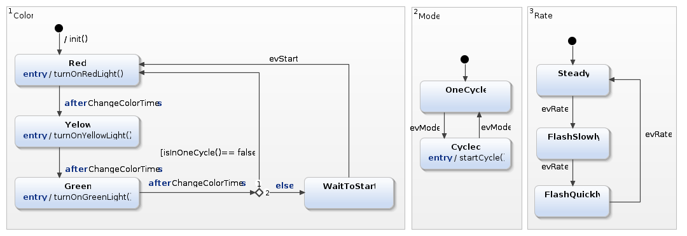
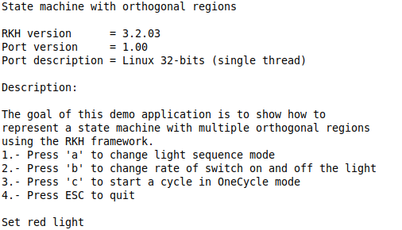

# Using state machines with orthogonal regions with RKH framework on Eclipse

## Overview
This example shows how to handle a state machine with multiple orthogonal 
regions from an active object by using the RKH framework. The following 
diagram shows a state machine with orthogonal regions. It was designed 
by using the [Yakindu Statechart Tool](https://www.itemis.com/en/yakindu/state-machine/).



A region as known as AND-state is an orthogonal part of either a composite 
state or a state machine. It contains vertexes (states and pseudostates) 
and transitions. The semantics of orthogonal regions is that they are 
*logically concurrent*. It means that in some sense they execute 
simultaneously. It implies that when regions are active, each active 
region must receive, in some sense, its own copy of the event sent to the 
state machine, and is free to act on it or discard it as appropriate.

Even though orthogonal regions are useful for specifying logical 
independence and concurrency in state machines, they are relatively 
complex to implement and they consume extra CPU cycles to achieve the 
logical concunrrency.

See [Design Patterns for Embedded Systems in C](https://www.elsevier.com/books/design-patterns-for-embedded-systems-in-c/douglass/978-1-85617-707-8) 
by Bruce Douglass and [Design Pattern - Orthogonal Component](https://www.state-machine.com/doc/Pattern_Orthogonal.pdf) by Miro Samek 
for more information about orthogonal regions.

## This tutorial contains:
- [Description](#description)
    - [Behavior and structure models](#behavior-and-structure-models)
    - [Container and component types](#container-and-component-types)
    - [Initializing container and its components](#initializing-container-and-its-components)
    - [Starting Mode and Rate components](#starting-mode-and-rate-components)
    - [Dispatching events](#dispatching-events)
- [What RKH is?](#what-rkh-is)
- [Toolchain installation](#toolchain-installation)
- [Eclipse CDT project](#eclipse-cdt-project)

## Description
### Behavior and structure models
The behavior of this example is defined by a statechart that looks as 
follows. 


This diagram consists of three regions Color, Mode and Rate, which are 
independent aspects of a system; Color has Red, Yellow, Green, and WaitStart 
states, Mode has OneCycle, and Cycled states, and Rate contains Steady, 
FlashSlowly, and FlashQuickly states.

Note that isInOneCycle() guard causes Color to depend somewhat on Mode, 
and indeed to know something about the inner states of Mode. There is another 
kind of dependency between Color and Mode. When Cycled state is entered an 
evStart event is sent to itself, so it will be received by all regions. This 
mechanism is useful to propagate events between regions.

Since RKH framework does not implicitely support orthogonal regions, a 
workaround is performed to implement the state diagram shown above.

In the RKH framework state machines (SM) are executed in context of concurrent 
units called active objects (AO), so they have state-based behavioral. 
Each AO receives events from the system as asynchronous messages. 
These messages are temporarily stored in a dedicated queue, and when the AO is 
executed it dispatchs stored events one by one to its associated SM.

The proposed workaround to deal with a SM with multiple orthogonal regions 
consists mainly in using an independent SM to represent each 
region and to dispatch every received event to them. So, it partitions the 
behavioral into separate state machine objects. 

Partitioning introduces a container–component relationship. The container 
implements the primary functionality and delegates other (secondary) features
to the components. Both the container and the components have state-based 
behavioral. 
The container is an active object whereas the components are passive ones, 
which are executed in context of its container. It means they share both 
event queue and priority level of its container.
The container communicates with the components by directly dispatching events 
to them. The components notify the container by posting events to it, never 
through direct event dispatching.

In other words, the container is entirely responsible for its components. In 
particular, it must explicitly trigger initial transitions in its components 
as well as directly dispatch events to them.

In this example the container is called `LightMgr` and its components are 
called `Mode` and `Rate`. `LightMgr`'s behavior is represented by the Color 
region, whereas `Mode` and `Rate` behavior are defined by the Mode and Rate 
regions respectively. The following diagram shows their relationships. 


### Container and component types
The following code fragment shows the `LightMgr`, `Mode` and  `Rate` types 
represented by means of C structures. These types are derived from framework 
ones. `Mode` and `Rate` derive from `RKH_SM_T`, which defines a state machine 
and `LightMgr` derives from `RKH_SMA_T`, which represents an active object.

```c
struct LightMgr
{
    RKH_SMA_T sma;      /* base class  */
    RKHSmaVtbl vtbl;    /* virtual table */
    RKHTmEvt tmEvtObj0; /* timer tmEvtObj0 */
    RKHTmEvt tmEvtObj1; /* timer tmEvtObj1 */
    RKHTmEvt tmEvtObj2; /* timer tmEvtObj2 */
    Mode mode;          /* orthogonal region */ 
    Rate rate;          /* orthogonal region */ 
};

struct Mode
{
    RKH_SM_T sm;        /* base class */
};

struct Rate
{
    RKH_SM_T sm;        /* base class */
};
```
### Initializing container and its components
The `LightMgr` active object is initialized in two stages, the first one is at 
compile-time (static initialization), and the other one is at runtime 
(dynamic initialization). Code listing below, which  belongs to `LightMgr.c` 
file, shows how `LightMgr` and its components are initialized at compile-time, 
lines (1) and (2-3) respectively.
```c
(1) RKH_SMA_CREATE(LightMgr,            /* Active object type */
                   lightMgr,            /* Active object instance */
                   LightMgrPrio,        /* Active object priority */
                   HCAL,                /* It is a hierarchical SM */
                   &LightMgr_Red,       /* Default state of Light region */
                   LightMgr_init,       /* Topmost initial action of Light */
                   NULL);
    RKH_SMA_DEF_PTR(lightMgr);

(2) RKH_SM_CONST_CREATE(rate,           /* Name of Rate SM */
                        1,
                        HCAL,           /* It is a hierarchical SM */
                        &Rate_Steady,   /* Default state of Rate region */
                        Rate_init,      /* Topmost initial action of Rate */
                        NULL);
(3) RKH_SM_CONST_CREATE(mode,           /* Name of Mode SM */
                        2,
                        HCAL,           /* It is a hierarchical SM */
                        &Mode_OneCycle, /* Default state of Mode region */
                        Mode_init,      /* Topmost initial action of Mode*/
                        NULL);
```
The dynamic initialization of `LightMgr` and its components are executed 
by the `LightMgr` constructor called `LightMgr_ctor()` as shown in the 
listing below. The constructor initialized both virtual table and the 
components of `LightMgr`. Section 1.5 explain why is defined a virtual 
table and how to use it.
```c
/* ---------------------------- Global functions --------------------------- */
void
LightMgr_ctor(void)
{
    LightMgr *me = RKH_DOWNCAST(LightMgr, lightMgr);

    me->vtbl = rkhSmaVtbl;      /* Initialize AO's virtual table and */
    me->vtbl.task = dispatch;   /* override its dispatch operation */
    rkh_sma_ctor(RKH_UPCAST(RKH_SMA_T, me), &me->vtbl);
    RKH_SM_INIT(&me->rate,      /* Instance of SM component */
                rate,           /* Complete next parameters with the */
                1,              /* same values used in the macro */
                HCAL,           /* RKH_SM_CONST_CREATE() */
                &Rate_Steady,
                Rate_init,
                NULL);
    RKH_SM_INIT(&me->mode,      /* Instance of SM component */
                mode,           /* Complete next parameters with the */
                2,              /* same values used in the macro */
                HCAL,           /* RKH_SM_CONST_CREATE() */
                &Mode_OneCycle,
                Mode_init,
                NULL);
}
```

### Starting Mode and Rate components
`LightMgr` initializes every state machine component by explicitly calling the 
framework function `rkh_sm_init()`. It effectively triggers the topmost initial 
transition of a state machine and then the effect action of the state 
machine's initial pseudostate is executed.
```c
/* ............................ Effect actions ............................. */
static void 
LightMgr_init(LightMgr *const me, RKH_EVT_T *pe)
{
    /* init(); */
    RKH_TR_FWK_AO(me);
    RKH_TR_FWK_QUEUE(&RKH_UPCAST(RKH_SMA_T, me)->equeue);
    RKH_TR_FWK_STATE(me, &LightMgr_Red);
    RKH_TR_FWK_STATE(me, &LightMgr_Yelow);
    RKH_TR_FWK_STATE(me, &LightMgr_Green);
    RKH_TR_FWK_STATE(me, &LightMgr_WaitToStart);
    RKH_TR_FWK_SIG(evStart);
    RKH_TR_FWK_SIG(evTout0);
    RKH_TR_FWK_SIG(evTout1);
    RKH_TR_FWK_SIG(evTout2);
    RKH_TR_FWK_TIMER(&me->tmEvtObj0.tmr);
    RKH_TR_FWK_TIMER(&me->tmEvtObj1.tmr);
    RKH_TR_FWK_TIMER(&me->tmEvtObj2.tmr);

    rkh_sm_init(RKH_UPCAST(RKH_SM_T, &me->mode));
    rkh_sm_init(RKH_UPCAST(RKH_SM_T, &me->rate));
}
```

### Dispatching events
Follow steps below to explicitly dispatch received events to every component.

1. First of all, enable option `RKH_CFG_SMA_VFUNCT_EN` in the RKH configuration 
file called `rkhcfg.h`
```c
#define RKH_CFG_SMA_VFUNCT_EN           RKH_ENABLED
```
2. Define the virtual table of `LightMgr` as one of its attributes. It must be 
of type `RKHSmaVtbl`
```c
    struct LightMgr
    {
        RKH_SMA_T sma;      /* base class  */
(*)     RKHSmaVtbl vtbl;    /* virtual table */
        ...
    };
```
3. Initialize `LightMgr`'s virtual table, override its dispatch 
operation and call the base class constructor, lines (1) and (2) and (3) 
respectively. These steps are according to section 1.3
```c
    LightMgr_ctor(void)
    {
        LightMgr *me = RKH_DOWNCAST(LightMgr, lightMgr);

(1)     me->vtbl = rkhSmaVtbl;      /* Initialize AO's virtual table and */
(2)     me->vtbl.task = dispatch;   /* override its dispatch operation */
(3)     rkh_sma_ctor(RKH_UPCAST(RKH_SMA_T, me), &me->vtbl);
        ...
    }
```
4. Finally, implement the `LightMgr`'s dispatch operation to dispatch received 
events to each component as shown in lines (1) to (3).
```c
    static void
    dispatch(RKH_SMA_T *me, void *arg)
    {
        LightMgr *realMe;

        realMe = RKH_DOWNCAST(LightMgr, me);
(1)     rkh_sm_dispatch(RKH_UPCAST(RKH_SM_T, realMe), (RKH_EVT_T *)arg);
(2)     rkh_sm_dispatch(RKH_UPCAST(RKH_SM_T, &realMe->mode), (RKH_EVT_T *)arg);
(3)     rkh_sm_dispatch(RKH_UPCAST(RKH_SM_T, &realMe->rate), (RKH_EVT_T *)arg);
    }
```

## What RKH is?
RKH is a flexible, efficient, highly portable, and freely available 
open-source state machine framework providing the infrastructure for quickly 
and safely developing reactive applications for real-time embedded systems.


RKH provides not only an unusual, efficient and straightforward method for implementing and executing state machines, but also the needed infrastructure to build reactive applications in embedded systems. It is composed of modules, procedures, and supporting tools; such as a method for implementing and executing flat state machines and statecharts, asynchronous messaging, cross-platform abstraction, run time tracing, time management, dynamic memory mechanism to deal with fragmentation, unit-test harness, plus others.

RKH allows developers to verify and validate a reactive application’s behaviour at runtime by means of the framework’s built-in tracer. It can utilize any traditional OS/RTOS or work without one. It also encourages the embedded software community to apply best principles and practices of software engineering for building flexible, maintainable and reusable software.

RKH is open source and licensed under the GNU v3.0\. You can find the [source code on GitHub](https://github.com/vortexmakes/RKH).

If you want to learn more about the benefits of this flexible, efficient and highly portable state machine framework read on [here](https://blogs.itemis.com/en/rkh-state-machine-framework-for-reactive-and-real-time-embedded-systems).

## Toolchain installation
### Eclipse C/C++ (CDT)
The C/C++ Development Toolkit ([CDT](https://help.eclipse.org/2020-03/index.jsp?topic=%2Forg.eclipse.cdt.doc.user%2Fconcepts%2Fcdt_c_projects.htm)) is a collection of Eclipse-based features that provides the capability to develop projects that use C and/or C++ as a programming language.
The CDT can either be installed as part of the Eclipse C/C++ IDE packaged zip file or installed into an existing Eclipse using the "Install New Software..." dialog. Follow [this](https://www.eclipse.org/cdt/downloads.php) instructions to do that.

### Get RKH framework
In order to build this example you have to download the RKH framework and install the Trazer tool. RKH can be obtained from its official repository by using the following Git commands:

1.  `cd path/to/rkh-examples/`
2.  `git submodule init orthogonal.eclipse-cdt/RKH`
3.  `git submodule update`

### Install Trazer tool
RKH allows developers to verify and validate a reactive application's behaviour at runtime by means of its built-in tracer. In addition, RKH provides a very simple but powerful console application, called Trazer, to visualize the trace events' output in a legible manner. It can be downloaded and installed as follows.

1.  Download Trazer for Linux 64-bits from its [official repository](https://github.com/vortexmakes/Trazer/releases/download/3.2/RC_trazer_3_2_lnx64b.tar.gz)
2.  Copy downloaded file to a folder and extract it
3.  Change the directory to previous folder
4.  Check it is alright by executing ./trazer

## Eclipse CDT project
### Import project
1. Select 'File > Import...' to bring up the Import wizard. 
2. Choose 'Existing Project into Workspace' and click the 'Next' button.
3. Select the 'orthogonal.eclipse-cdt' project directory.
4. Click the 'Finish' button to import the selected project into the workspace. 

### Project structure
#### _model_
It contains Color, Mode and Rate state machines. They are designed by using the [Yakindu Statechart Tool](https://www.itemis.com/en/yakindu/state-machine/).

#### _src_
It includes both application code and BSP (Board Support Package) code. The most important files and directories are listed below:

*   _signals.h_: defines signal events as enumerated constants, which are used as state machine triggers.
*   _events.h_: defines events types, which are derived from RKH framework types.
*   _priorities.h_: defines active object priorities as enumerated constants.
*   _LightMgr.h/.c_: specifies and implements the `LightMgr` active object (container) and `Mode` and `Rate` components. Please correlate these implementations with the state diagram shown above.
*   _main.c_: contains the main() function, which initializes both BSP and `LightMgr` active object, then executes the RKH framework in order to orchestrates this reactive application.
*   _rkhcfg.h_: adapts and configures RKH at compile-time.

#### _bsp_
It contains the BSP source code for Linux platform. It emulates interrupts, implements both communication with Trazer tool and a simple event-loop, which is a non-preemptive cooperative scheduler.

#### _RKH_
Here is located the RKH framework's source code.

### 4.3 Build
*   Right-click on project 'Orthogonal' in the 'Project Explorer'
*   Choose 'Build Project'

### Run and debug
*   Open a console, change the directory where you previously downloaded Trazer, and run it by executing the following command line: `./trazer -t 6602`
*   Right-click on project 'Orthogonal' in the Eclipse 'Project Explorer'
*   Choose 'Run As > Local C/C++ Application'

The embedded Eclipse console shows up and the application starts



In order to debug the example

*   Open a console, change the directory where you previously downloaded Trazer, and run it by executing the following command line: `./trazer -t 6602`
*   Right-click on project 'Parameterized' in the Eclipse 'Project Explorer'
*   Choose 'Debug As > Local C/C++ Application'

You will now see the debug perspective with the Parameterized application window open. The C/C++ editor repositions in 
the perspective.


### Verify and validate
While the application is running, you can validate and verify its behaviour through the trace events showed on the Trazer output.
Each trace event includes a time stamp and additional information associated with it. A capture of Trazer output is shown below. 


It shows the trace records when the `LightMgr` dispatches `evTout1` event to each state machine (regions), and then it get into the `Green` state.

Since RKH can generate more than 100 different trace events during its execution, its trace module allow you to filter one or more of them in runtime, so you can choose the traces that you need.
