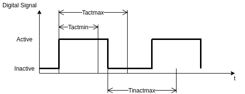
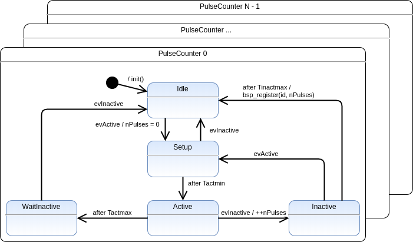

# Using parameterized state machines with RKH framework on Eclipse

## Overview
This example shows how to handle a parameterized state machine from an 
active object by using the RKH framework, a digital pulse counter will be used 
as an example. It validates and counts digital pulses from N digital signals 
of the same type, whose waveforms and its parameters are shown below.


    
## This tutorial contains:

[1\. Description](#1-description)

[2\. What RKH is?](#2-what-rkh-is)

[3\. Toolchain installation](#3-toolchain-installation)

[4\. Eclipse CDT project](#4-eclipse-cdt-project)

## 1\. Description
### 1.1 Behavior and structure models
The behavior of the pulse counters are modeled as statecharts, but they are 
not active objects. There is no UML notation to represent a parameterized 
state machine, so it could be drawn such as that of figure below.



Instead, pulse counters called `PulseCounter` are components of a container 
active object called `PulseCounterMgr`. The container is entirely responsible 
for its components. In particular, it must explicitly trigger initial 
transitions in all components as well as explicitly dispatch events to its 
components. They share both event queue and priority level of its container. 
The following diagram shows the relation between the container and its 
components and attributes. 


`PulseCounterMgr` communicates with `PulseCounters` synchronously by directly 
dispatching events to them, i.e. a `PulseCounter` processes events in the 
execution context of its container. On the other hand, `PulseCounters` 
communicates with its own active object and with the rest asynchronously by 
posting events to their event queues. It is important to mention that a state 
machine component cannot directly receive any event from an entity such as 
ISR, active object or system task different from its own container. 

The `PulseCounterMgr` behavior is modeled as statechart and it looks like the 
diagram below. 


The `PulseCounterMgr` is able to forward events to the 
corresponding `PulseCounter`, since these events carry a parameter called id 
that allows `PulseCounterMgr` to identify the component target. The type of id 
parameter depends on the active object implementation, for example, it might be 
an integer or a reference to a component instance.

### 1.2 PulseCounterMgr and PulseCounter types
The following code fragment shows the `PulseCounter` and `PulseCounterMgr` 
types represented by means of C structures. Both types are derived from 
framework ones. `PulseCounter` derives from `RKH_SM_T` and `PulseCounterMgr` 
derives from `RKH_SMA_T`.

```c
struct PulseCounter
{
    RKH_SM_T sm;        /* base class */
    TimeEvt tactMin;    /* timer tactMin */
    TimeEvt tactMax;    /* timer tactMax */
    TimeEvt tinactMax;  /* timer tinactMax */
    uint32_t nPulses;   /* amount of detected pulses */
    int id;             /* identification */
    PulseCounterMgr *thePulseCounterMgr; /* reference to its own container */
};

struct PulseCounterMgr
{
    RKH_SMA_T sma;      /* base class  */
    PulseCounter pulseCounters[NUM_PULSE_COUNTERS]; /* SM components */
};
```
### 1.3 Initializing PulseCounter instances
Code fragment below shows how the `PulseCounterMgr` constructor initializes the 
components' attributes.

```c
/* ---------------------------- Global functions --------------------------- */
void
PulseCounterMgr_ctor(void)
{
    int i;
    PulseCounterMgr *me = RKH_DOWNCAST(PulseCounterMgr, pulseCounterMgr);
    PulseCounter *pulseCtr;

    for (i = 0; i < NUM_PULSE_COUNTERS; ++i)
    {
        pulseCtr = &me->pulseCounters[i];
        pulseCtr->id = i;
        pulseCtr->nPulses = 0;
        pulseCtr->tactMin.id = i;
        pulseCtr->tactMax.id = i;
        pulseCtr->tinactMax.id = i;
        pulseCtr->thePulseCounterMgr = me;
        RKH_SM_INIT(pulseCtr,     /* Instance of SM component */
                    pulseCounter, /* Complete next parameters with the */
                    1,            /* same values used in the macro */
                    HCAL,         /* RKH_SM_CONST_CREATE() */
                    &PulseCounter_Idle,
                    PulseCounter_init,
                    NULL);
    }
}
```

### 1.4 Initializing PulseCounter state machines
`PulseCounterMgr` initializes every state machine component by calling the 
framework function `rkh_sm_init()`. It effectively triggers the topmost initial 
transition of a state machine and then the effect action of the state 
machine's initial pseudostate is executed.

```c
/* ............................ Effect actions ............................. */
void
PulseCounterMgr_init(PulseCounterMgr *const me, RKH_EVT_T *pe)
{
    int i;
    PulseCounter *pulseCtr;
    ...
    for (pulseCtr = &me->pulseCounters[0], i = 0;
         i < NUM_PULSE_COUNTERS;
         ++i, ++pulseCtr)
    {
        rkh_sm_init(RKH_UPCAST(RKH_SM_T, pulseCtr));
    }
}
```

### 1.5 Events
`PulseCounterMgr` and its components handle two types of events, `StatusEvt`
and `TimeEvt`. `StatusEvt` carries the status of digital signals (Active and 
Inactive), whereas `TimeEvt` corresponds to time events, so the `after` triggers 
are triggered by the expiration of the `PulseCounter` time events like 
`tactMin`, `tactMax` and `tinactMax`. For example, `after TactMin` corresponds 
to `tactMin` time event.
As shown in the following code fragment, both kinds of events derive from 
framework event types, `RKH_EVT_T` and `TimeEvt` respectively and both have an 
`id` parameter to identify the `PulseCounter` target. See `bsp_keyParser()` 
function in the `bsp/bsp.c` file to figure out how to generate and post events 
to a specific `PulseCounter.

```c
/* ................................ Events ................................ */
typedef struct StatusEvt StatusEvt;
struct StatusEvt
{
    RKH_EVT_T evt;  /* signal event */
    int id;         /* SM component identifier */
};

typedef struct TimeEvt TimeEvt;
struct TimeEvt
{
    RKHTmEvt evt;  /* time event */
    int id;        /* SM component identifier */
};
```

### 1.6 Dispatching events to PulseCounters
The following code fragment demonstrates how to use the `id` parameter of 
received events to dispatch them to `PulseCounters`. This example defines 
`id` parameter as `integer`, so it becomes the index into the `pulseCounters[]` 
array.

```c
void
PulseCounterMgr_dispatchStatus(PulseCounterMgr *const me, RKH_EVT_T *pe)
{
    int ix;

    ix = RKH_DOWNCAST(StatusEvt, pe)->id;
    RKH_REQUIRE(ix <= NUM_PULSE_COUNTERS);

    rkh_sm_dispatch(RKH_DOWNCAST(RKH_SM_T, &me->pulseCounters[ix]), pe);
}
```

If `id` parameter were a pointer to `PulseCounter` instance, 
`PulseCounterMgr` actions like `PulseCounterMgr_dispatchStatus()` would look 
as follows:

```c
void
PulseCounterMgr_dispatchStatus(PulseCounterMgr *const me, RKH_EVT_T *pe)
{
    PulseCounter *component;

    component = RKH_DOWNCAST(StatusEvt, pe)->id;
    RKH_REQUIRE(component != (PulseCounter *)0);

    rkh_sm_dispatch(RKH_DOWNCAST(RKH_SM_T, component), pe);
}
```

## 2\. What RKH is?
RKH is a flexible, efficient, highly portable, and freely available 
open-source state machine framework providing the infrastructure for quickly 
and safely developing reactive applications for real-time embedded systems.


RKH provides not only an unusual, efficient and straightforward method for implementing and executing state machines, but also the needed infrastructure to build reactive applications in embedded systems. It is composed of modules, procedures, and supporting tools; such as a method for implementing and executing flat state machines and statecharts, asynchronous messaging, cross-platform abstraction, run time tracing, time management, dynamic memory mechanism to deal with fragmentation, unit-test harness, plus others.

RKH allows developers to verify and validate a reactive application’s behaviour at runtime by means of the framework’s built-in tracer. It can utilize any traditional OS/RTOS or work without one. It also encourages the embedded software community to apply best principles and practices of software engineering for building flexible, maintainable and reusable software.

RKH is open source and licensed under the GNU v3.0\. You can find the [source code on GitHub](https://github.com/vortexmakes/RKH).

If you want to learn more about the benefits of this flexible, efficient and highly portable state machine framework read on [here](https://blogs.itemis.com/en/rkh-state-machine-framework-for-reactive-and-real-time-embedded-systems).

## 3\. Toolchain installation
### 3.1 Eclipse C/C++ (CDT)
The C/C++ Development Toolkit ([CDT](https://help.eclipse.org/2020-03/index.jsp?topic=%2Forg.eclipse.cdt.doc.user%2Fconcepts%2Fcdt_c_projects.htm)) is a collection of Eclipse-based features that provides the capability to develop projects that use C and/or C++ as a programming language.
The CDT can either be installed as part of the Eclipse C/C++ IDE packaged zip file or installed into an existing Eclipse using the "Install New Software..." dialog. Follow [this](https://www.eclipse.org/cdt/downloads.php) instructions to do that.

### 3.2 Get RKH framework
In order to build this example you have to download the RKH framework and install the Trazer tool. RKH can be obtained from its official repository by using the following Git commands:

1.  `cd path/to/rkh-examples/`
2.  `git submodule init parameterized-sm.eclipse-cdt/RKH`
3.  `git submodule update`

### 3.3 Install Trazer tool
RKH allows developers to verify and validate a reactive application's behaviour at runtime by means of its built-in tracer. In addition, RKH provides a very simple but powerful console application, called Trazer, to visualize the trace events' output in a legible manner. It can be downloaded and installed as follows.

1.  Download Trazer for Linux 64-bits from its [official repository](https://github.com/vortexmakes/Trazer/releases/download/3.2/RC_trazer_3_2_lnx64b.tar.gz)
2.  Copy downloaded file to a folder and extract it
3.  Change the directory to previous folder
4.  Check it is alright by executing ./trazer

## 4\. Eclipse CDT project
### 4.1 Import project
1. Select 'File > Import...' to bring up the Import wizard. 
2. Choose 'Existing Project into Workspace' and click the 'Next' button.
3. Select the 'parameterized-sm.eclipse-cdt' project directory.
4. Click the 'Finish' button to import the selected project into the workspace. 

### 4.2 Project structure
#### _model_
It contains PulseCounter and PulseCounterMgr state machines

#### _src_
It includes both application code and BSP (Board Support Package) code. The most important files and directories are listed below:

*   _signals.h_: defines signals as enumerated constants, which are used as state machine triggers.
*   _events.h_: defines events types, which are derived from RKH framework types.
*   _priorities.h_: defines active object priorities as enumerated constants.
*   _PulseCounterMgr.h/.c_: specifies and implements the PulseCounterMgr active object and its paramterized state machine (PulseCounter). Please correlate this implementation with the state diagrams shown above.
*   _main.c_: contains the main() function, which initializes both BSP and PulseCounterMgr active object, then executes the RKH framework in order to orchestrates this reactive application.
*   _rkhcfg.h_: adapts and configures RKH in compile time.

#### _bsp_
It contains the source code of BSP for Linux platform. It emulates interrupts, implements the communication with Trazer tool and a simple event-loop, which is a non-preemptive cooperative scheduler.

#### _RKH_
Here is located the RKH framework's source code.

### 4.3 Build
*   Right-click on project 'Parameterized' in the 'Project Explorer'
*   Choose 'Build Project'

### 4.4 Run and debug
*   Open a console, change the directory where you previously downloaded Trazer, and run it by executing the following command line: `./trazer -t 6602`
*   Right-click on project 'Parameterized' in the Eclipse 'Project Explorer'
*   Choose 'Run As > Local C/C++ Application'

The embedded Eclipse console shows up and the application starts


In order to debug the example

*   Open a console, change the directory where you previously downloaded Trazer, and run it by executing the following command line: `./trazer -t 6602`
*   Right-click on project 'Parameterized' in the Eclipse 'Project Explorer'
*   Choose 'Debug As > Local C/C++ Application'

You will now see the debug perspective with the Parameterized application window open. The C/C++ editor repositions in 
the perspective.


### 4.5 Verify and validate
While the application is running, you can validate and verify its behaviour through the trace events showed on the Trazer output.
Each trace event includes a time stamp and additional information associated with it. A capture of Trazer output is shown below. 


It shows the trace records when the PulseCounterMgr dispatches a `evActive` trigger to a PulseCounter component, and then it get into the `Setup` state. After `ACT_MIN_TIME` seconds it goes to `Active` state and stay there until it receives `evInactive` trigger, causing it goes to `Inactive` state. Finally, after `INACT_MAX_TIME` seconds it returns `ACT_MIN_TIME` state. 

Since RKH can generate more than 100 different trace events during its execution, its trace module allow you to filter one or more of them in runtime, so you can choose the traces that you need.
