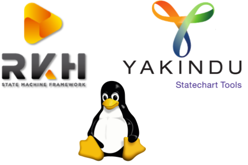

<!DOCTYPE html>
<html lang="en">
<head>
<meta charset="UTF-8">
<title>Time Event with Yakindu and RKH framework on Linux</title>
<link href="../css/style.css" rel="stylesheet">
</head>
<body class="body-container">
  

    <h1>Time Event with Yakindu and RKH framework on Linux</h1>

    <h2>Overview</h2>
      
This is a simple example of how to use the RKH framework together with 
      Yakindu Statechart Tool for using Time Event´s in statecharts models. 

      

      
      
This tutorial contains:

      
<a href="#1">1. TimeEvt Statechart Model</a>

      
<a href="#2">2. What RKH is?</a>

      
<a href="#3">3. Toolchain installation</a>

      
<a href="#4">4. Yakindu project</a>

    <h2 id="1">1. TimeEvt Statechart Model</h2>

      
The behavior of timeEvt is defined by a simple statechart that looks 
      as follows.

      

    <h2 id="2">2. What RKH is?</h2>
    

      RKH is a flexible, efficient, highly portable, and freely available 
      open-source state machine framework providing the infrastructure for 
      quickly and safely developing reactive applications for real-time 
      embedded systems.
    

    

    

      RKH provides not only an unusual, efficient and straightforward method 
      for implementing and executing state machines, but also the needed 
      infrastructure to build reactive applications in embedded systems. It 
      is composed of modules, procedures, and supporting tools; such as a 
      method for implementing and executing flat state machines and 
      statecharts, asynchronous messaging, cross-platform abstraction, run 
      time tracing, time management, dynamic memory mechanism to deal with 
      fragmentation, unit-test harness, plus others.

    

      RKH allows developers to verify and validate a reactive application’s 
      behaviour at runtime by means of the framework’s built-in tracer. It 
      can utilize any traditional OS/RTOS or work without one. It also 
      encourages the embedded software community to apply best principles and 
      practices of software engineering for building flexible, maintainable 
      and reusable software.

    

      RKH is open source and licensed under the GNU v3.0. You can find the 
      <a href=https://github.com/vortexmakes/RKH>source code on GitHub</a>.

    

      If you want to learn more about the benefits of this flexible, 
      efficient and highly portable state machine framework read on 
      <a href=https://blogs.itemis.com/en/rkh-state-machine-framework-for-reactive-and-real-time-embedded-systems>here</a>.

    <h2 id="3">3. Toolchain installation</h2>
      <h3>3.1 Install YAKINDU Statechart Tool</h3>
      
 YAKINDU Statechart Tools features an intuitive combination of 
          graphical and textual notation for modelling state diagrams.
          While states, transitions and state hierarchies are graphical elements,
          all declarations and actions are specified using a textual notation.
          The usability of the statechart editor is simply fascinating.
          Form more information please visit:

          <a href=https://www.itemis.com/en/yakindu/state-machine/>Yakindu SCT site</a> 

      

      
Download Linux installer from here:
      <a href=https://info.itemis.com/state-machine/download-yakindu-statechart-tools>Yakinud Download Site</a> 
 

      <h3>3.2 Install RKH code generator </h3>
      
 
        Open Yakindu SCT and goes to:
      <ol>
      <li>Help > Install New Software ... from the menu.</li>
      <li>Select the Yakindu Labs entry from the Work with: pull down list. 
          If there is no such entry then</li>
      <ol>
        <li>Choose Add</li>
        <li>Enter <code> http://updates.yakindu.com/statecharts/labs </code>
            in the Location field and optionally choose a name</li>
        <li>Press OK</li>
      </ol>
      <li>Unfold the top level node and check the RKH generator feature.</li>
      <li>Finish the installation wizard by choosing Next > until finished.</li>
      <li>Restart.</li>
      </ol>
      

      

      <h3>3.3 Get RKH framework</h3>
      
 
      In order to build this example you have to download the RKH 
      framework and install the Trazer tool.
      RKH can be obtained from its official repository by using the following 
      Git commands:

      <ol>
      <li><code>cd path/to/rkh-examples/</code></li>
      <li><code>git submodule init timeEvt.yakindu.linux/RKH </code></li>
      <li><code>git submodule update</code></li>
      </ol>
      <h3>3.4 Install Trazer tool</h3>
      
 
      RKH allows developers to verify and validate a reactive application’s 
      behaviour at runtime by means of its built-in tracer. In addition, 
      RKH provides a very simple but powerful console application, called 
      Trazer, to visualize the trace events’ output in a legible manner. It 
      can be downloaded and installed as follows.

    <ol>
      <li>Download Trazer for Linux 64-bits from its 
          <a href=https://github.com/vortexmakes/Trazer/releases/download/3.2/RC_trazer_3_2_lnx64b.tar.gz>
          official repository</a></li>
      <li>Copy downloaded file to a folder and extract it</li>
      <li>Change the directory to previous folder</li>
      <li>Check it is alright by executing ./trazer</li>
    </ol>
    

    <h2 id="4">4. Yakindu project</h2>

    <h3>4.1 Project structure</h3>
    <dl>
      <dt>model</dt>
      <dd>contains TimeEvt state machine (timeEvt.sct) and generator model (timeEvt.sgen)</dd>
      <dt>src</dt>
      <dd>Includes both application code and BSP (Board Support Package) code. 
      The most important files and directories are listed below:</dd>
      <ul>
        <li><i>signals.h</i>: defines signals as enumerated constants, which 
        are used as state machine triggers.</li>
        <li><i>main.c</i>: contains the main() function, which initializes 
        both BSP and Blinky active object, then executes the RKH framework in 
        order to orchestrates this reactive application.</li>
        <li><i>rkhcfg.h</i>: adapts and configures RKH in compile time.</li>
        <li><i>bsp</i>: this folder contains the source code of BSP for Linux 
        platform.  It emulates interrupts, implements the communication with 
        Trazer tool and a simple event-loop, which is a non-preemptive 
        cooperative scheduler. In the Yakindu’s Standard Edition you cannot 
        include header files, but it is possible to create operations, in 
        which the platform specific C code can be called. Within these 
        operations we can call the specific code to interact with the 
        platform, which is located in this folder.</li>
      </ul>
      <dt>src-gen</dt>
      <dd>Includes the generated C code compatible with RKH 
      framework, which will be automatically be updated when you edit and 
      save the statechart.</dd>
      <ul>
        <li><i>TimeEvt.h/.c</i>: specifies and implements the state machine of 
        TimeEvt active object. Please correlate this implementation 
        (TimeEvt.c) with the state diagram shown above.</li>
        <li><i>TimeEvt.h/.c</i>: specifies and implements the state machine 
        actions (entries, exits, effects and guards).</li>
        <li><i>TimeEvtActRequired.h</i>: in the Yakindu’s Standard Edition you 
        cannot include header files, but it is possible to create operations, 
        in which the Blinky specific c code can be called. Within these 
        operations we can call the specific C code to interact with the 
        platform.</li>
      </ul>
      <dt>rkh</dt>
      <dd>Here is located the RKH framework’s source code.</dd>
    </dl>
    

    <h3>4.2 Build</h3>
    <ul>
      <li>Right-click on project 'timeEvt.yakindu.linux' in the 'Project Explorer'</li>
      <li>Choose 'Build Project'</li>
    </ul>
    <h3>4.3 Run and debug</h3>
    <ul>
      <li>Open a console, change the directory where you previously 
          downloaded Trazer, and run it by executing the following command 
          line: <code>./trazer -t 6602</code></li>
      <li>Right-click on project 'blinky' in the Eclipse 'Project Explorer'</li>
      <li>Choose 'Run As > Local C/C++ Application'</li>
      
The embedded Eclipse console shows up and the application starts

      

    </ul>
      
In order to debug the example

    <ul>
      <li>Open a console, change the directory where you previously 
          downloaded Trazer, and run it by executing the following command 
          line: <code>./trazer -t 6602</code></li>
      <li>Right-click on project 'blinky' in the Eclipse 'Project Explorer'</li>
      <li>Choose 'Debug As > Local C/C++ Application'</li>
      
You will now see the debug perspective with the blinky application 
      window open. The C/C++ editor repositions in the perspective.

      

    </ul>
    <h3>4.4 Verify and validate</h3>
      
While the application is running, you can validate and verify its 
      behaviour through the trace events showed on the Trazer output. Each 
      trace event includes a time stamp and additional information associated 
      with it. A capture of Trazer output is shown below. It shows the trace 
      records when the state machine processes a <code>evStart</code> 
      trigger and get into the <code>Waiting</code> state. <code>After 5 secs</code>
      goes to <code>DoneWaiting</code> state and stay there until 
      <code>After 10 secs</code> trigger is 
      preocessed returning to <code>Off</code> state.
      Since RKH can generate more than 100 different trace events 
      during its execution, its trace module allow you to filter one or more 
      of them in runtime, so you can choose the traces that you need.
      

      

  

</body>
</html>
